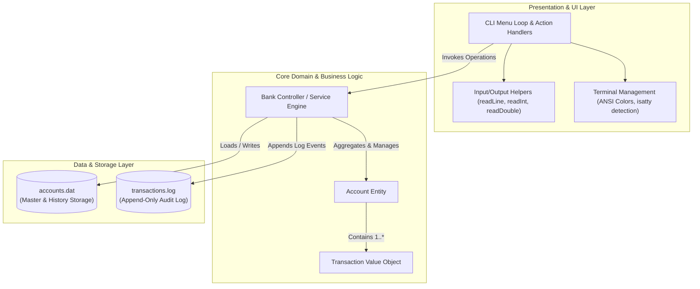
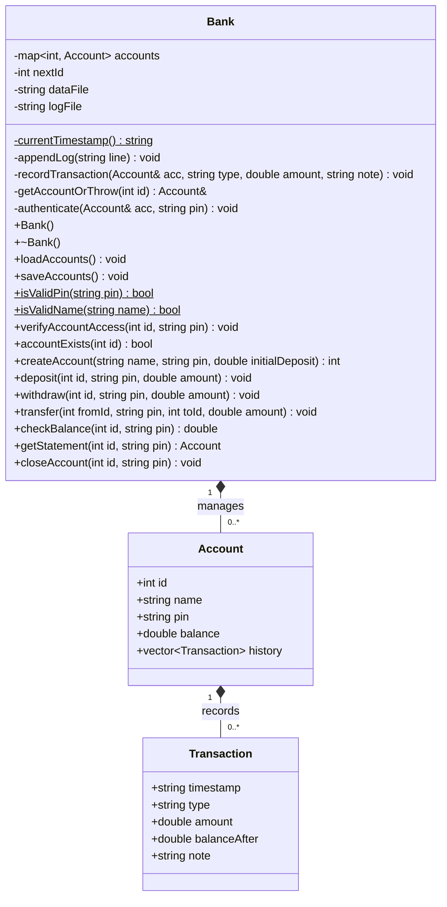
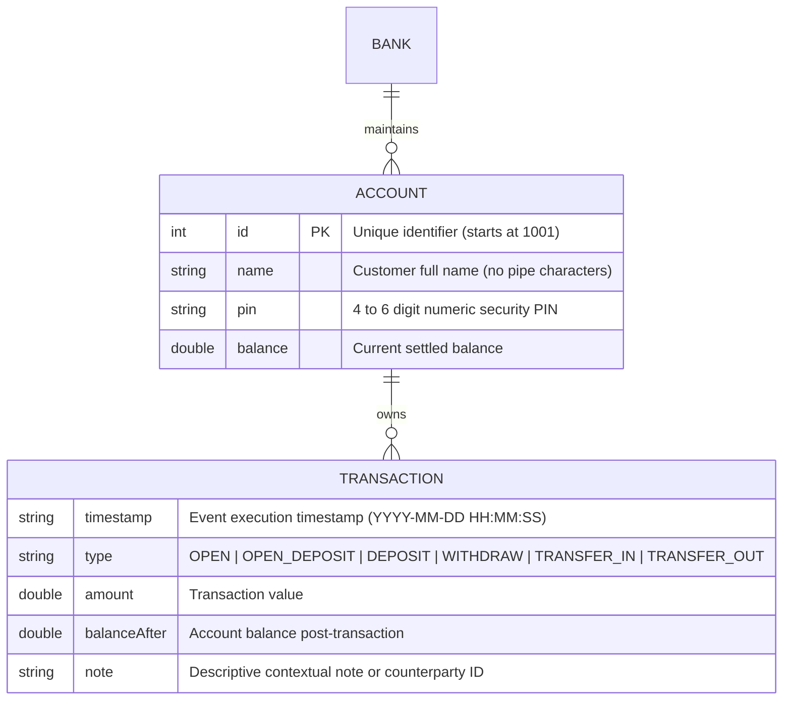
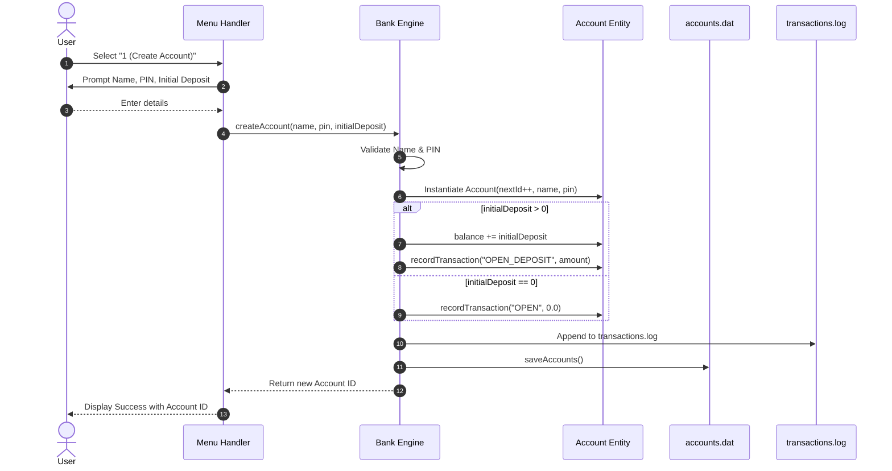
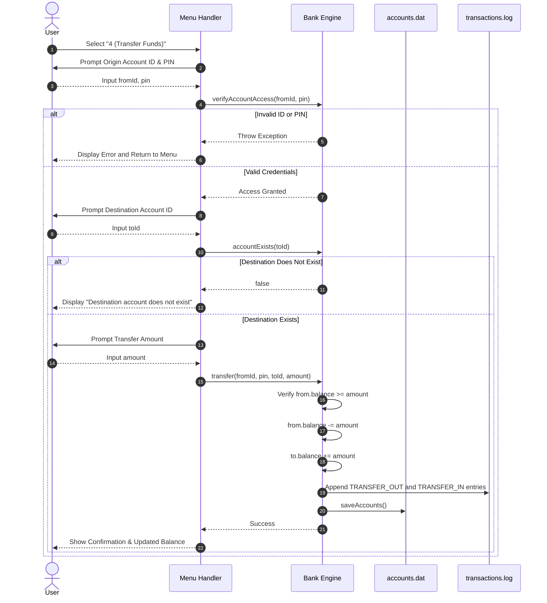

# Core Banking System

[](https://en.cppreference.com/w/cpp/17)
[](#compilation--running)
[](#compilation--running)
[](#persistence--storage-design)
[](#overview--key-features)
[](#security--business-rules)
[](LICENSE)
[](https://github.com/tanishpal23)

A lightweight, self-contained Core Banking System CLI application written in **C++17**, featuring robust business rule validation, PIN-secured transactions, disk persistence, append-only audit logging, and an interactive, colorized terminal UI.

---

## Table of Contents
- [Overview & Key Features](#overview--key-features)
- [System Architecture](#system-architecture)
- [UML Class Diagram](#uml-class-diagram)
- [Entity-Relationship (ER) Diagram](#entity-relationship-er-diagram)
- [Sequence & Workflow Diagrams](#sequence--workflow-diagrams)
  - [Account Creation Workflow](#account-creation-workflow)
  - [Fund Transfer Workflow (Fail-Fast)](#fund-transfer-workflow-fail-fast)
- [Persistence & Storage Design](#persistence--storage-design)
  - [accounts.dat](#accountsdat)
  - [transactions.log](#transactionslog)
- [Security & Business Rules](#security--business-rules)
- [Compilation & Running](#compilation--running)
  - [Prerequisites](#prerequisites)
  - [Build Commands](#build-commands)
- [License](#license)
- [Author](#-author)

---

## Overview & Key Features

- **Account Management**: Open accounts with full customer names, 4–6 digit numeric PINs, and optional initial deposit amounts.
- **Fail-Fast Transaction Processing**: Authenticates accounts and verifies credentials immediately before requesting operational details (e.g., recipient ID or transfer amount), preventing unnecessary user input on invalid requests.
- **Financial Operations**:
  - **Cash Deposit**: Safely increments account balance and logs receipt.
  - **Cash Withdrawal**: Validates PIN and balance before debiting funds.
  - **Inter-Account Transfers**: Atomic balance deduction from sender and credit to receiver with dual transaction tracking.
  - **Balance Inquiry & Mini-Statement**: Displays real-time balances and full formatted chronological transaction histories.
  - **Account Closure**: Enforces zero-balance business rule (account must be emptied prior to deletion).
- **Persistent Storage**: Serializes accounts and complete transaction histories to disk (`accounts.dat`) so statements survive restarts.
- **Append-Only Audit Log**: Maintains an immutable text log (`transactions.log`) recording timestamps, account IDs, operation types, amounts, and final balances.
- **Cross-Platform Console UI**: Boxed ASCII menus and ANSI color schemes with automated detection of terminal interactivity (`isatty`) and Windows Virtual Terminal Processing support.

---

## System Architecture

The application adopts a clean, layered modular design separating Presentation, Domain Logic, and Storage Management within a unified, high-performance C++ implementation:



### Architectural Responsibilities

1. **Presentation Layer**: Handles user interaction, input parsing/type checking, formatted display tables, colored alerts, and terminal mode management.
2. **Domain Layer (`Bank`)**: Enforces transaction validity, PIN authentication, invariant checking (e.g., overdraft protection, account closure preconditions), and ID generation.
3. **Persistence Layer**: Implements custom pipe-delimited serialization and deserialization for account structures and append-only streaming for the compliance audit trail.

---

## UML Class Diagram

The following UML class diagram models the structural attributes, operations, access visibility, and relationships:



---

## Entity-Relationship (ER) Diagram



---

## Sequence & Workflow Diagrams

### Account Creation Workflow



### Fund Transfer Workflow (Fail-Fast)

Demonstrating the fail-fast security design where the origin account and PIN are authenticated prior to prompting for counterparty account or transfer value:



---

## Persistence & Storage Design

### `accounts.dat`
Stores full state including account definitions and historical ledger records. Data is stored in a line-based format where transaction records follow their respective account parent:

```text
ACCOUNT|<id>|<name>|<pin>|<balance>
TXN|<timestamp>|<type>|<amount>|<balanceAfter>|<note>
TXN|<timestamp>|<type>|<amount>|<balanceAfter>|<note>
```

#### Example:
```text
ACCOUNT|1001|Alice Smith|1234|450.00
TXN|2026-09-10 14:02:11|OPEN_DEPOSIT|500.00|500.00|Account opening deposit
TXN|2026-09-10 14:15:30|WITHDRAW|50.00|450.00|Cash withdrawal
ACCOUNT|1002|Bob Jones|5678|1050.00
TXN|2026-09-10 14:05:00|OPEN_DEPOSIT|1000.00|1000.00|Account opening deposit
TXN|2026-09-10 14:20:00|DEPOSIT|50.00|1050.00|Cash deposit
```

### `transactions.log`
An immutable, append-only log created for administrative auditing, reconciliation, and compliance:

```text
YYYY-MM-DD HH:MM:SS | Acc#<id> | <TYPE> | Amount: <amount> | Balance: <balance> | <note>
```

#### Example:
```text
2026-09-10 14:02:11 | Acc#1001 | OPEN_DEPOSIT | Amount: 500.00 | Balance: 500.00 | Account opening deposit
2026-09-10 14:15:30 | Acc#1001 | WITHDRAW | Amount: 50.00 | Balance: 450.00 | Cash withdrawal
2026-09-10 14:25:12 | Acc#1001 | TRANSFER_OUT | Amount: 100.00 | Balance: 350.00 | To Acc#1002
2026-09-10 14:25:12 | Acc#1002 | TRANSFER_IN | Amount: 100.00 | Balance: 1150.00 | From Acc#1001
```

---

## Security & Business Rules

| Rule | Description |
| :--- | :--- |
| **PIN Constraints** | Must consist strictly of 4 to 6 numeric digits (`0-9`). |
| **Name Validation** | Must be non-empty and cannot contain the delimiter character (`\|`) to prevent serialization injection. |
| **Fail-Fast Authentication** | Operations requiring credentials check the account ID and PIN before taking supplementary inputs. |
| **Overdraft Protection** | Withdrawals and outgoing transfers check that `amount <= balance`; negative balances are forbidden. |
| **Self-Transfer Prevention** | Transfers where `fromId == toId` are rejected. |
| **Account Closure Condition** | An account can only be deleted/closed if its settled balance is exactly `0.00`. |

---

## Compilation & Running

### Prerequisites
- A C++17 compatible compiler (e.g., `g++` 8.0+, `clang++` 7.0+, or MSVC 2019+).

### Build Commands

#### Linux / macOS
```bash
# Compile
g++ -std=c++17 -O2 -Wall -Wextra -o bankingSystem bankingSystem.cpp

# Run
./bankingSystem
```

#### Windows (MinGW-w64 / GCC)
```powershell
# Compile
g++ -std=c++17 -O2 -Wall -Wextra -o bankingSystem.exe bankingSystem.cpp

# Run
.\bankingSystem.exe
```

#### Windows (MSVC Developer Command Prompt)
```cmd
# Compile
cl /std:c++17 /O2 /W4 /EHsc bankingSystem.cpp /Fe:bankingSystem.exe

# Run
bankingSystem.exe
```

---

## License

This project is licensed under the [MIT License](LICENSE).

---

## 👨‍💻 Author

Developed and maintained by **[Tanish](https://github.com/tanishpal23)**.

- **GitHub Profile**: [Tanish](https://github.com/tanishpal23)
- **Project Repository**: [Banking System](https://github.com/Tanishpal23/Banking-System)

---

<p align="center">
  Made with ❤️ by <a href="https://github.com/tanishpal23"><strong>Tanish</strong></a>
</p>

